

<a href="mailto:hellosanjaygautam@gmail.com"><picture><source media="(prefers-color-scheme: dark)" srcset="assets/masthead-dark.svg"></picture></a>

<picture><source media="(prefers-color-scheme: dark)" srcset="assets/proof-dark.svg"></picture>

<picture><source media="(prefers-color-scheme: dark)" srcset="assets/eyebrow-ship-dark.svg"></picture>

<a href="https://github.com/luv-jeri/tool-factory-skills"><picture><source media="(prefers-color-scheme: dark)" srcset="assets/cta-red-dark.svg"></picture></a>

<table>
<tr>
<td width="33%" valign="top">

**🏭 TOOL-FACTORY-SKILLS**

My public AI skill factory — fail-closed gates, adversarial review, agents building agents.

[→ the receipts](https://github.com/luv-jeri/tool-factory-skills)

</td>
<td width="33%" valign="top">

**⚡ APPS IN DAYS**

Production-grade apps shipped in days, not months — specs, tests and evidence ledgers included.

[→ selected work](https://www.hellosanjay.com/)

</td>
<td width="33%" valign="top">

**🔁 THIS PROFILE**

This README is a build artifact — generated and refreshed by the same pipeline it describes.

[→ how it works](https://github.com/luv-jeri/luv-jeri)

</td>
</tr>
</table>

<b>📠 SPEC SHEET — peek at the pipeline</b>

 

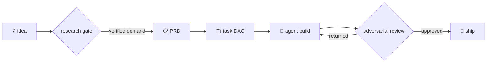

Every stage is a skill with a fail-closed linter behind it. Nothing ships on vibes.

<picture><source media="(prefers-color-scheme: dark)" srcset="assets/eyebrow-acts-dark.svg"></picture>

<table>
<tr>
<td width="33%" align="center"><picture><source media="(prefers-color-scheme: dark)" srcset="assets/act-builder-dark.svg"></picture></td>
<td width="33%" align="center"><picture><source media="(prefers-color-scheme: dark)" srcset="assets/act-teacher-dark.svg"></picture></td>
<td width="33%" align="center"><picture><source media="(prefers-color-scheme: dark)" srcset="assets/act-founder-dark.svg"></picture></td>
</tr>
</table>

<picture><source media="(prefers-color-scheme: dark)" srcset="assets/seal-dark.svg"></picture>

<picture><source media="(prefers-color-scheme: dark)" srcset="assets/eyebrow-featured-dark.svg"></picture>

<table>
<tr>
<td width="50%"><picture><source media="(prefers-color-scheme: dark)" srcset="assets/feat-credentials-dark.svg"></picture></td>
<td width="50%"><picture><source media="(prefers-color-scheme: dark)" srcset="assets/feat-courses-dark.svg"></picture></td>
</tr>
<tr>
<td width="50%"><picture><source media="(prefers-color-scheme: dark)" srcset="assets/feat-carbon-dark.svg"></picture></td>
<td width="50%"><picture><source media="(prefers-color-scheme: dark)" srcset="assets/feat-dmrv-dark.svg"></picture></td>
</tr>
</table>

### COMPONENT CATALOG

| CATEGORY | COMPONENTS |
|---|---|
| **FRONTEND** | `React` `Next.js` `TypeScript` `Vue` `Tailwind` `Redux` |
| **BACKEND** | `Node.js` `NestJS` `GraphQL` `MongoDB` `PostgreSQL` `Redis` |
| **CLOUD** | `AWS` `GCP` `Docker` `Kubernetes` `Firebase` `GitHub Actions` |
| **AI TOOLING** | `Claude Code` `MCP` `Agent pipelines` `Cursor` `v0` |
| **CRAFT** | `Three.js` `GSAP` `WebGL` `Canvas` |

<picture><source media="(prefers-color-scheme: dark)" srcset="assets/eyebrow-dashboard-dark.svg"></picture>

<picture><source media="(prefers-color-scheme: dark)" srcset="assets/pulse-dark.svg">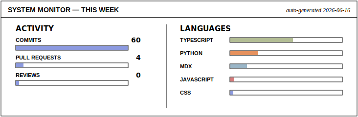</picture>

### 🔨 NOW BUILDING

<!-- NOW-BUILDING:START -->
- 🔨 **[tool-factory-skills](https://github.com/luv-jeri/tool-factory-skills)** — Evidence-gated Claude Code skill pipeline for shipping micro web tools: pick-next-tool, competitive analysis, PRD generator (+9 planned). IRON LAWS, fail-closed engines, adversarial passes, RED-GREEN evals.
- 🔨 **[projects-prd-generator](https://github.com/luv-jeri/projects-prd-generator)** — Fail-closed PRD generator skill: turns a measured competitive brief (prd_seed) into a single-source-of-truth PRD + machine build-spec, validated by a Python engine (prd_lint) and an adversarial skeptic. Stage 3 of pick-next-tool / projects-competitive-analysis / projects-prd-generator.
- 🔨 **[projects-competitive-analysis](https://github.com/luv-jeri/projects-competitive-analysis)** — Claude Code skill: turns a product gist/PRD into a MEASURED, source-ledgered competitive brief that feeds the PRD. Downstream twin of pick-next-tool.
<!-- NOW-BUILDING:END -->

<picture><source media="(prefers-color-scheme: dark)" srcset="https://github-readme-activity-graph.vercel.app/graph?username=luv-jeri&bg_color=0d1117&color=e6edf3&line=8c9ae0&point=c0d4a7&area=true&area_color=11161f&hide_border=true&radius=0"></picture>

<picture>
  <source media="(prefers-color-scheme: dark)" srcset="https://raw.githubusercontent.com/luv-jeri/luv-jeri/output/github-snake-dark.svg">
  
</picture>

  

<a href="mailto:hellosanjaygautam@gmail.com"><picture><source media="(prefers-color-scheme: dark)" srcset="assets/btn-work-dark.svg"></picture></a>&nbsp;
<a href="https://www.hellosanjay.com/"><picture><source media="(prefers-color-scheme: dark)" srcset="assets/btn-portfolio-dark.svg"></picture></a>&nbsp;
<a href="https://www.linkedin.com/in/luv-jeri/"><picture><source media="(prefers-color-scheme: dark)" srcset="assets/btn-linkedin-dark.svg"></picture></a>

<picture><source media="(prefers-color-scheme: dark)" srcset="assets/footer-nav-dark.svg"></picture>

<i>This profile rebuilds itself daily. Hand-cut SVG, zero webfonts, one red panel — exactly as 1996 intended.</i>

